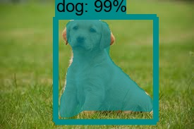

# Instance Segmentation

Beyond image classification and object detection, the Computer Vision problems where a single thing must be recognized or multiple class instances should be recognized and detected with each bounding boxes, a new challenge appears: Semantic and Instance Segmentation.  
The main objective of this approach is to recognize pixel-wise to which class belongs every instance of a given image, supposing that the model we're applying's been trained on this classes. This project uses the TensorFlow object detection Mask RCNN model to achieve that. Several scripts are provided depending on what functionality is required.

## Dependencies

It's mandatory to download a [Tensorflow detection model](https://github.com/tensorflow/models/blob/master/research/object_detection/g3doc/detection_model_zoo.md) and locate it outside the project like this:
```
├───TensorFlow Object Detection Models
│   └───trained_models
│       ├───mask_rcnn_inception_v2_coco_2018_01_28
│       │
│       ├───mask_rcnn_resnet50_atrous_coco
│       │
│       └───...
│
├───Instance-Segmentation
│   │   instance_segmentation.py
│   │   instance_segmentation_images.py
│   │   instance_segmentation_webcam.py
│   │   ...
│   │
│   └───object_detection
```

As this project aims to perform instance segmentation, it's necessary to use any of the Mask RCNN models available. Depending on the specs of your environment, you may choose one faster or other with a better mean Average Precision (mAP).

If you're a conda user, you can create an environment from the ```instance_segmentation_env.yml``` file using the Terminal or an Anaconda Prompt for the following steps:

1. Create the environment from the ```instance_segmentation_env.yml``` file:

    ```conda env create -f instance_segmentation_env.yml```
2. Activate the new environment:
    * Windows: ```activate instance_segmentation```
    * macOS and Linux: ```source activate instance_segmentation``` 

3. Verify that the new environment was installed correctly:

    ```conda list```
    
You can also clone the environment through the environment manager of Anaconda Navigator.

## Use

Simply activate the virtual environment and execute the Python scripts.

### instance_segmentation.py

This program will take the input image file, feed it into the Segmentation model and generate two windows with the original and the processed image. Use example:

```
python instance_segmentation.py -i images/my_image.jpg
```

By default, if not images are provided, this output'll be displayed.



### instance_segmentation_images.py

The script will process every *.jpg* image in the *images/* folder and save them in the *segmented_images/* folder.

### instance_segmentation_webcam.py

Here, the instance segmentation'll be applied to the frame captured by the first available webcam. Press the 'q' button in the generated floating windows or *Ctrl+C* to stop the execution. It's also possible to discriminate among the trained classes: when calling the ```run_inference_for_single_image``` function, pass as an optional argument a list containing the id's of the COCO classes you want to detect. The model will just display the detected instances of those classes.  
Note that this is a high demanding task in computational terms, even when using the most lightweight model available. Consider using GPU acceleration for this purposes.

## License

This project is licensed under the MIT License - see the [LICENSE.md](LICENSE.md) file for details

## Acknowledgments

* [TF Object Detection](https://github.com/tensorflow/models/tree/master/research/object_detection)
